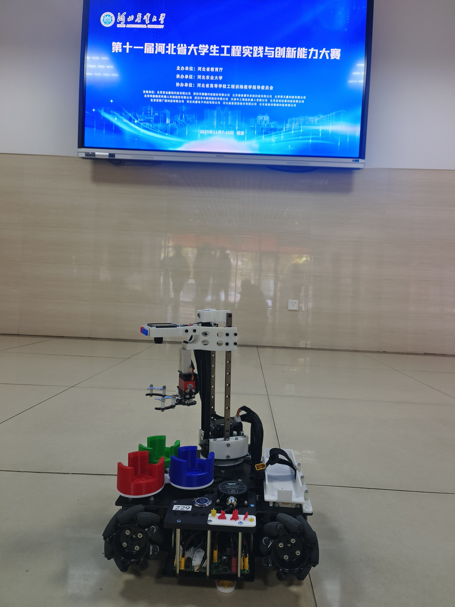
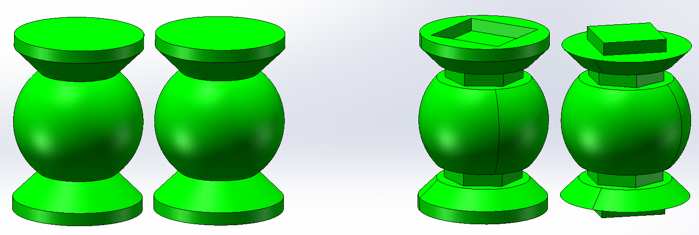
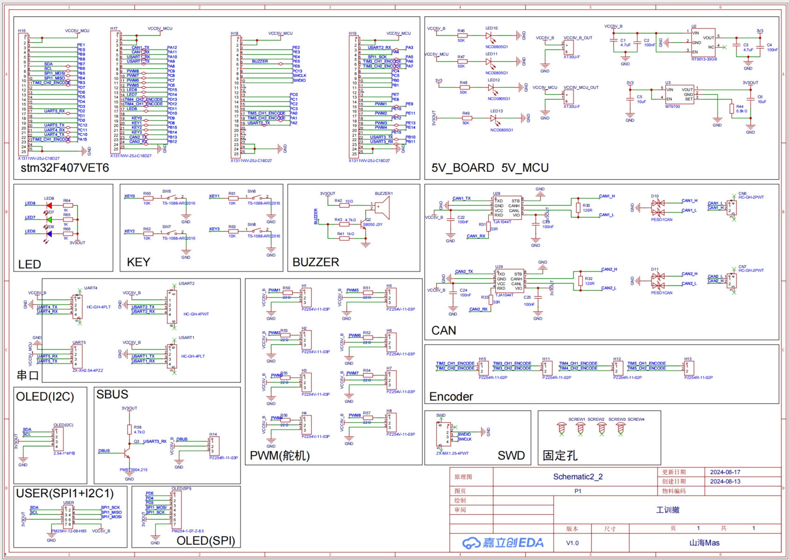
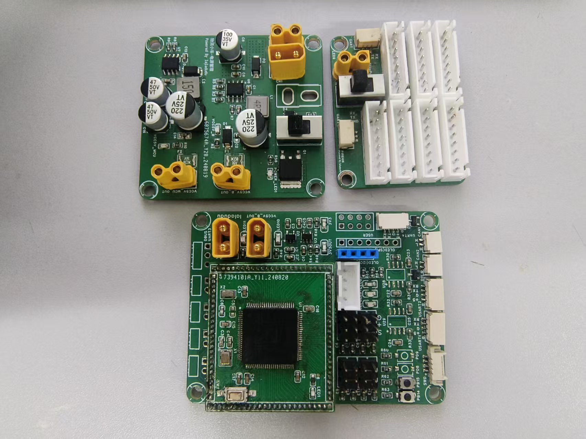
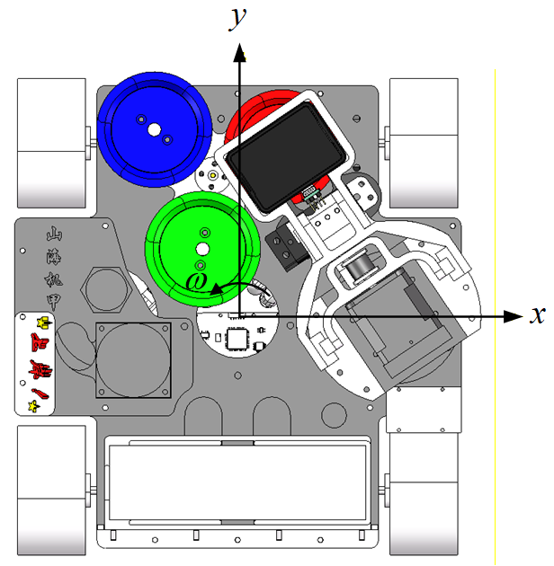
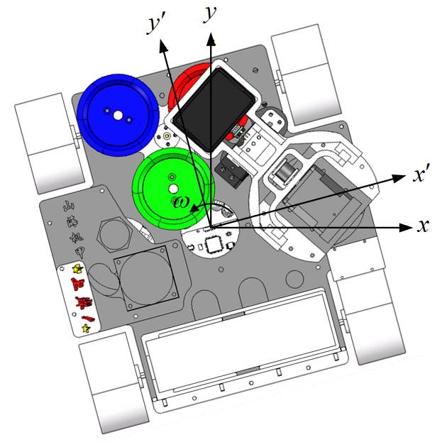

# 智能物流2025技术报告

从2024由于不可控因素与国赛擦肩而过，到2025用2分34全一环近乎满分的成绩拿下省冠，也算是弥补了遗憾。马上要毕业了，现将部分资料完全开源（主要是视觉方面我不是很懂，没办法讲解原理），希望能对各位车友有所帮助。

## 机械结构

PS:机械结构经过多次修改，还有一部分是根据实物的二次加工，开源里的机械结构也是这两天重新建模的，可能与实物略有差别。

### 器件选型

#### 底盘

| 器件       | 选型                 |      | 器件     | 选型                 |
| ---------- | -------------------- | ---- | -------- | -------------------- |
| 轮子       | 实验室捡的，型号未知 |      | 驱动电机 | 张大头42步进及驱动器 |
| 陀螺仪     | HWT101CT             |      | 电池     | 格式5300mAh          |
| 二维码模块 | GM865                |      |          |                      |

几点说明：

1. 在2024年我们最初使用的陀螺仪为正点原子六轴角度传感器，没有外壳屏蔽，在比赛时受到强磁干扰数据紊乱，痛失良机。笔者再次深切建议不要怜惜money，陀螺仪这种关键器件还是做好屏蔽比较稳妥。

2. 电池用5300有点过了，体积太大了，笔者觉得2400mAh就很足够了，为了体积小，用1650mAh也未尝不可。

3. 一些眼尖的车友应该发现了我们的车上装载了OPS9定位系统，但实际比赛中并未使用，不知为何，我们的OPS9经常出现数据不回传的现象，稳定性很差，最后还是回归了纯陀螺仪方案。

#### 云台抓取与存储机构

| 器件          | 选型         |      | 器件     | 选型                 |
| ------------- | ------------ | ---- | -------- | -------------------- |
| 物料盘舵机    | 鑫辉25kg标速 |      | 升降电机 | 张大头42步进及驱动器 |
| 云台Yaw轴舵机 | 鑫辉10kg高速 |      | 摄像头   | MaixCam              |
| 夹爪舵机      | 南古10kg高速 |      |          |                      |

几点说明：

1. 由于采用了两个10kg高速舵机，堵转电流很大，需要为其单独供电。

2. Yaw轴舵机采用10kg有点冒险了，过高的速度导致Yaw轴旋转会带动整车偏移，笔者通过舵机的正弦加减速对此进行了一定优化，同时小扭矩导致舵机有点拉不住云台，不过问题不大。

3. 同步带的张紧可以通过调整`同步带轮上连接块`中的孔的位置来调整，不过时间长后打印件会发生不可逆的形变导致再次变松，如果有条件可以上CNC。

### 初决赛夹爪与料盘结构

初赛与决赛物料对比

#### 物料盘

**初赛**

**决赛**

在物料盘中加入方向槽以卡住物料

#### 夹爪

**初赛**

**决赛**

### 问题与改进

1. 在实际调试中，我们发现左前轮会略有悬空，主要在于重量大量集中在右后轮，笔者曾尝试通过配重块来配平，但效果一般，笔者还有想法，就是加入简单的悬挂系统或者减少底板的刚度，通过形变来使四轮着地，不过由于精力所限，笔者并未证实方案的可行性。

2. 其实笔者还在考虑是否可以将舵轮底盘引入智能物流，其实在2024赛季笔者尝试过将传统全向轮结构引入，不过效果并不好，一是打滑现象严重，二是全向结构导致大量空间被浪费，不过笔者感觉舵轮轮组可能是一个思考方向，其优势还是在于会具有更小的打滑情况，甚至可以忽略不计，会有更高的定位精度。

3. 对于定位系统，在B站上出现了好多低成本方案，笔者目前对于光流计方案很感兴趣，如果有车友成功使用可以和笔者分享一下。

4. 对于云台机构，单自由度的升降机构上限有限，笔者建议加入前伸的自由度，实现转盘的任意位置抓取，笔者在想，合适的前伸机构能否实现色环区域不通过移动底盘而放置三个物料，车油们可以尝试一下。感觉如果我们的车加上前伸机构可能可以进2分的时间。

5. 夹爪部分，笔者这两年也尝试过单层爪和双层爪，感觉各有利弊吧，双层爪抓取效果更好，但单层爪干涉情况更少，工作空间更大。

6. 对于视觉模块，虽然MaixCam足够了，但想要更高的稳定性，可以考虑miniPC搭配OpenCV，效果更好。

## 整体控制策略

我们的主体思路采用纯陀螺仪移动加视觉定位实现全局移动。

## 硬件原理图

由于电路部分由潘先生打板制作且未开源，在此仅展示主控原理图和实物图。

### 问题与改进

1. 由于潘先生采用了三块板子且主控单做了一块核心板，体积略大，如果考虑减小体积，可以考虑一体成型双面制板，可以大量减少走线，不过制作难度、维护难度和焊接难度都会增大，要慎重考虑。

2. 对于舵机供电，建议做单独大电流供电，由于我们Yaw舵机和夹爪舵机均采用高速舵机，堵转电流在1A以上，一起运动会导致电压骤降设备重启，笔者暂时通过额外降压模块为这两个舵机供电以解决设备重启的问题。

## 视觉

参见潘先生的Gitee[laladuduqq/工训-物流](https://gitee.com/laladuduqq/work-training---logistics)

## 电控框架

笔者的整体框架采用STM32F4裸机开发，通过定时器和DMA与外设交互，实现数据的高速处理。

同时通过预编译指令进行策略的切换，并将待调参数集中在几个文件中方便调试。

### 代码介绍

#### System

**Delay** 延时函数

#### Hardware

**Camera** 摄像头 采用DMA发送+双缓冲接收

**HWT101** 陀螺仪 采用DMA双缓冲接收

**Key** 按键 采用定时器扫描更新按键状态

**OLED** 显示屏 自定义字模库显示任务码

**QR** 二维码模块 采用DMA发生+串口阻塞接收

**Steer** 舵机

**StepMotor** 步进电机 采用DMA发送并通过定时器实时更新步进状态

#### Control

**PID** PID控制

#### CarBody

**Arm** 爪臂机构 通过枚举控制三个舵机和升降步进的状态

**Gimbal** 云台 抓取和放置函数

**Chassis_Path** 底盘路径

**Chassis_PID** 底盘PID

**Chassis** 底盘

**zpc_zxc** 主函数

#### User

**main** 主程序

**zpc_zxc_Parameter** 参数

**zpc_zxc_Typedef** 自定义

**zpc_zxc_Headfile** 头文件

**isr** 中断

**Data** 数据处理

## 底盘运动

### 麦轮逆运动学解算

网上有好多相关的理论推导教程，比较基础，再此仅给出最后结果：
$$
\begin{align}
v_{左前轮}&=v_{x}+v_{y}-w(r_{x}+r_{y})\\
v_{右前轮}&=v_{x}-v_{y}-w(r_{x}+r_{y})\\
v_{左后轮}&=-v_{x}+v_{y}-w(r_{x}+r_{y})\\
v_{右后轮}&=-v_{x}-v_{y}-w(r_{x}+r_{y})
\end{align}
$$
由于工训赛中对角速度没有准确性要求，我们也只是通过陀螺仪角度环获取$w$，故，在实际使用中，笔者忽略了系数$(r_{x}+r_{y})$。

### 正弦加减速

由于速度突变会导致一定程度的打滑出现，对于工训赛这种对定位要求极高的赛事中会有很大影响，于是笔者采用正弦加减速来缓和不同速度之间的切换。计算公式如下：
$$
v_i=v_1+(v_2-v_1)\left(\cfrac{1}{2}-\cfrac{1}{2}cosf\left(\cfrac{\pi}{K}\times i\right)\right)
$$
其中，$K$表示加减速的周期数，$i$表示加减速过程中的第$i$个周期。

### 漂移

所谓漂移，也只是实现了边转弯边直走的功能，不同路径再通过正弦加减速加以过渡。

其中，$x$和$y$是期望坐标系，$x^\prime$和$y^\prime$是底盘实际坐标系，两坐标系的偏角可以通过陀螺仪读取。

而我们所需要的是在期望坐标系上的移动，所有我们输入的$v_x$和$v_y$也是在期望坐标系上，而我们能通过逆解算获取四个轮速度的是底盘实际坐标系，这两者之间差了一个坐标变换，公式如下：
$$
\left\{
\begin{array}{l}
v_x^\prime=v_x\ cos(\theta)+v_y\ sin(\theta);\\[2ex]
v_y^\prime=-v_x\ sin(\theta)+v_y\ cos(\theta);
\end{array}
\right.
$$
其中，$\theta$是两个坐标系夹角，从期望坐标系指向实际坐标系。这样就可以实现边转边直走了。

不过距离漂移我们还差一个小细节。如果在路径中加入偏角，我们就不能直接从$v_1$过渡到$v_2$了，因为两者的坐标系不同，这中间还要加一个坐标变换，公式如下：
$$
\left\{
\begin{array}{l}
v_{x1}=v_{x1}^\prime\ cos(\theta)+v_{y1}^\prime\ sin(\theta);\\[2ex]
v_{y1}=-v_{x1}^\prime\ sin(\theta)+v_{y1}^\prime\ cos(\theta);
\end{array}
\right.
$$
其中，$\theta$是两个坐标系夹角，即上一条路径的期望转角，$v_{x1}^\prime$和$v_{y1}^\prime$是上一条路径的原始期望，$v_{x1}$和$v_{y1}$是用于做正弦加减速的原始速度。

## 后记

由于笔者精力有限，又在备考，有些地方写的不太详尽，望见谅。

最后希望各车友成绩步步高升。

> **通讯方式：（QQ）zpclyn 2297651490**
